#### 1. 로그인

* 일반 / 카카오 간편 회원 가입 및 로그인

<table>
  <tr>
    <td>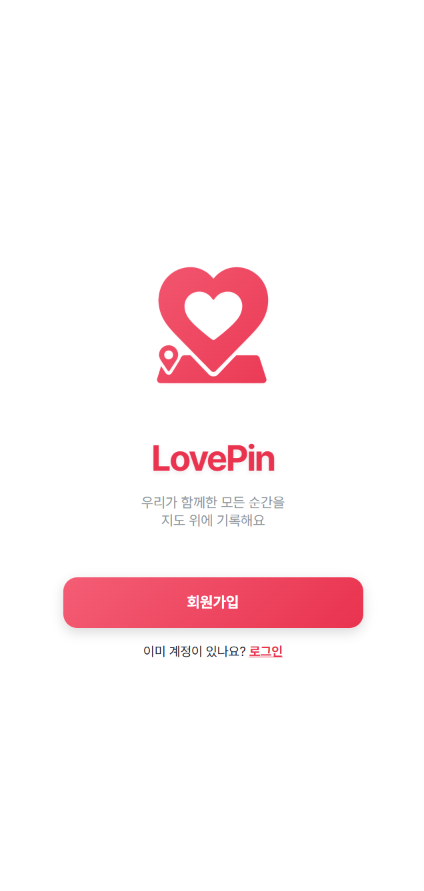</td>
    <td>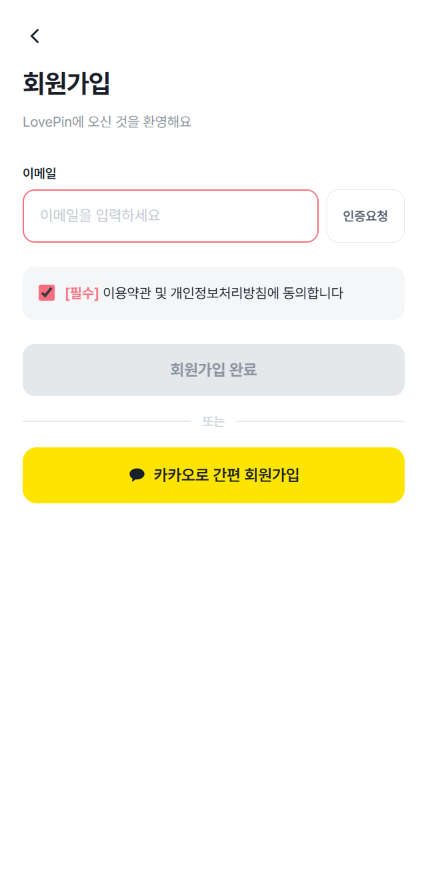</td>
    <td>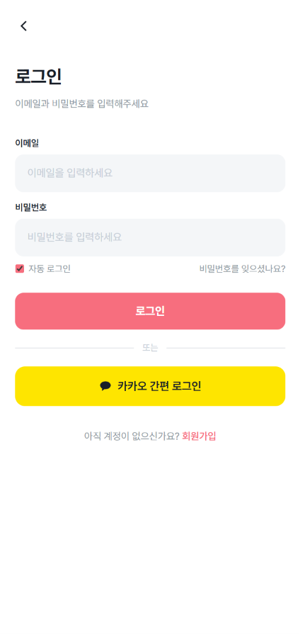</td>
  </tr>
</table>

#### 2. 연인 관계 관리

##### 2-1. 연인 매칭 전 개인 모드

* 상대방의 고유 코드를 입력하여 매칭 요청 가능 (본인 코드 입력 불가)
* 매칭 수신, 매칭 대기 등의 알림 확인 가능

<table>
  <tr>
    <td>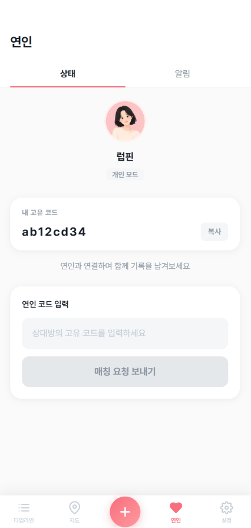</td>
    <td>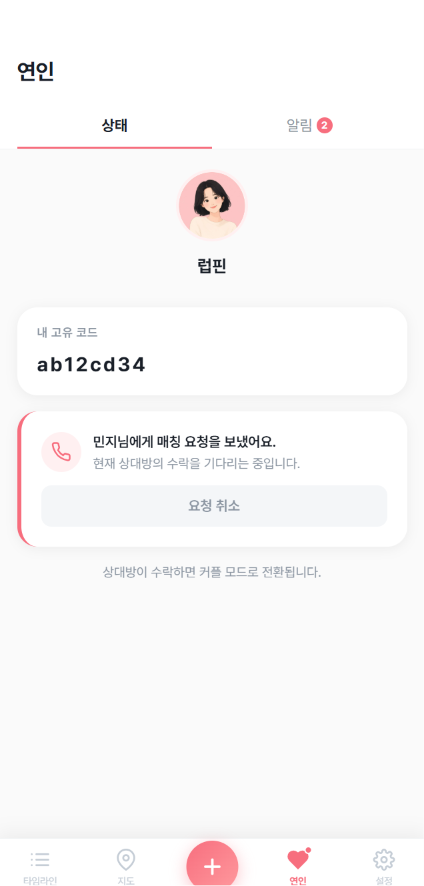</td>
  </tr>
</table>

##### 2-2. 연인 매칭 상태 커플 모드

* 자신과 상대방의 프로필 확인 가능
* D-Day 설정 및 수정 가능
* 연결 해제 가능
* 연인 관련 기록 알림, D-Day, 매칭 관련 알림 확인 가능

<table>
  <tr>
    <td>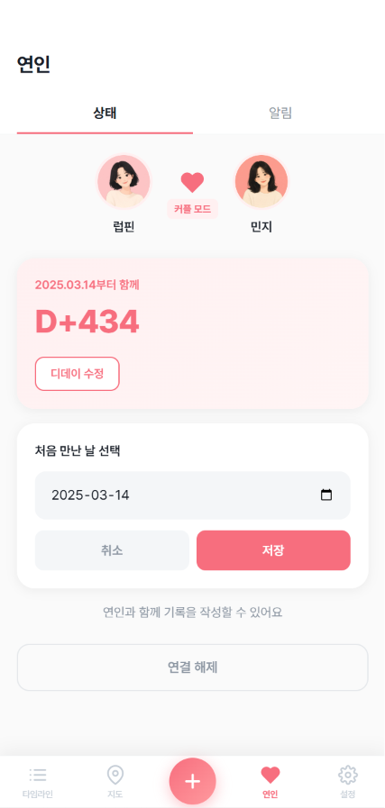</td>
    <td>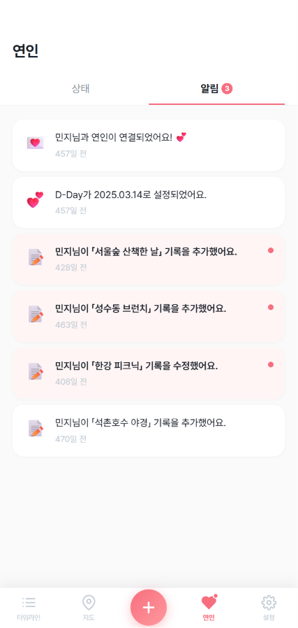</td>
  </tr>
</table>

#### 3. 타임라인

* 연인과 본인이 작성한 기록을 상하 스크롤 타임라인 형식으로 확인 가능
* 태그, 위치, 작성 기간 필터링 가능
* 기록 클릭 시 상세 페이지로 이동

<table>
  <tr>
    <td>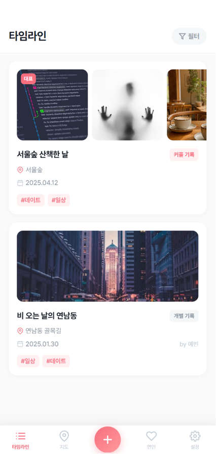</td>
    <td>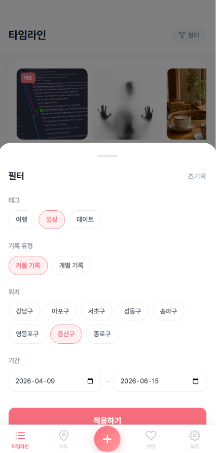</td>
  </tr>
</table>

#### 4. 지도

* 위치마다 군집으로 묶어 대표 사진으로 위치 핀 표시
* 확대 정도에 따라 위치 핀을 세분화하여 표시 (시/군 → 구/동 → 상세 위치)
* 기록 유형 (커플 기록/개별 기록) 필터링 가능
* 위치 핀 클릭 시 해당 핀 군집의 기록 카드 확인 가능
* 기록 카드 하단 상세보기 클릭 시 상세 페이지로 이동

<table>
  <tr>
    <td>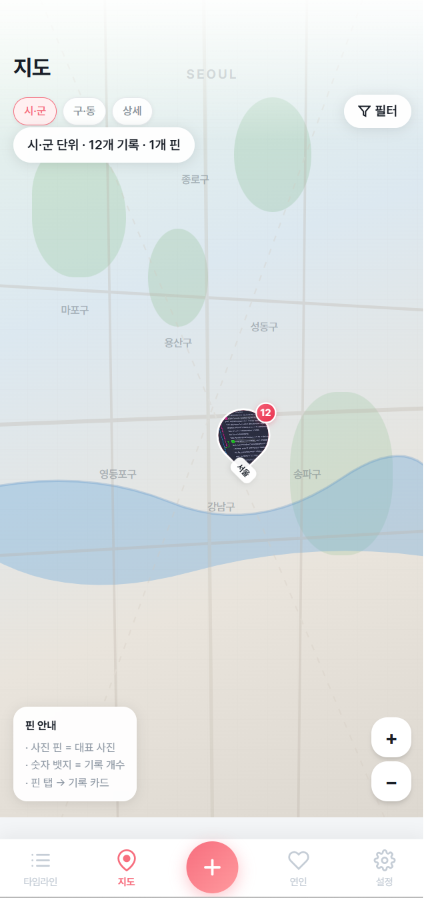</td>
    <td>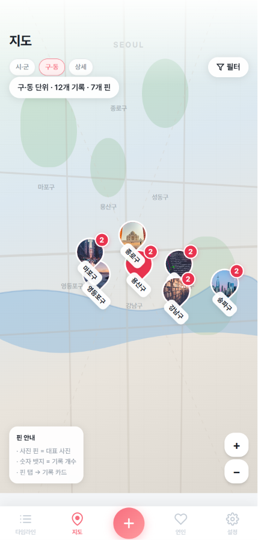</td>
    <td>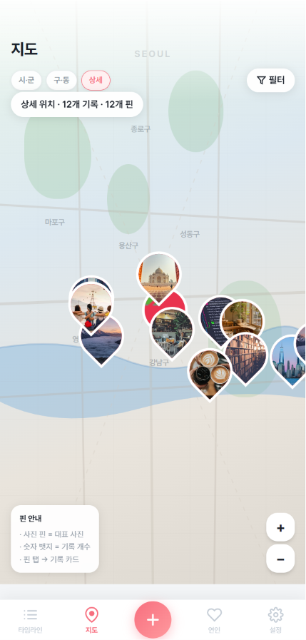</td>
  </tr>
  <tr>
    <td>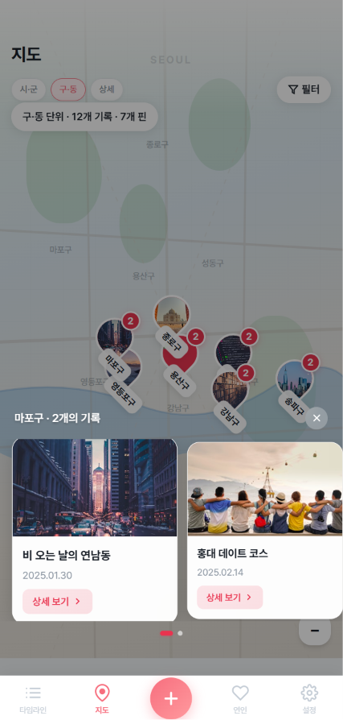</td>
    <td>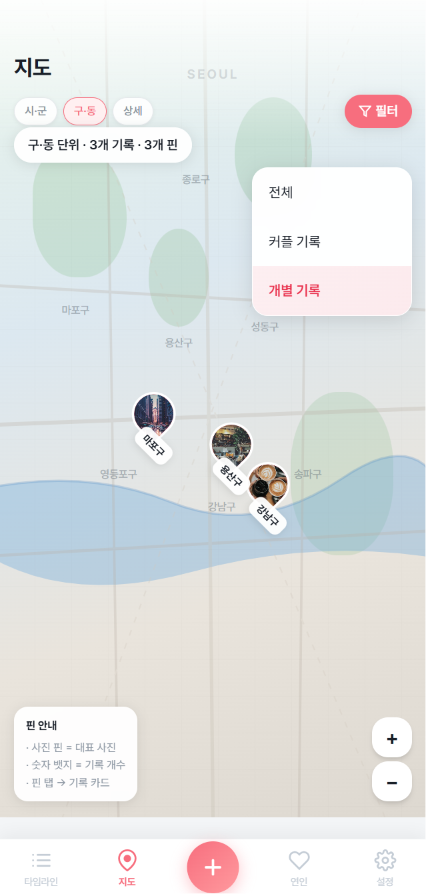</td>
  </tr>
</table>

#### 5. 상세 페이지

* 해당 기록의 제목, 본문, 위치, 작성 날짜, 태그, 사진 등 상세 정보를 확인
* 커플 기록의 경우 연인이 작성한 기록 수정 및 삭제 가능

<table>
  <tr>
    <td>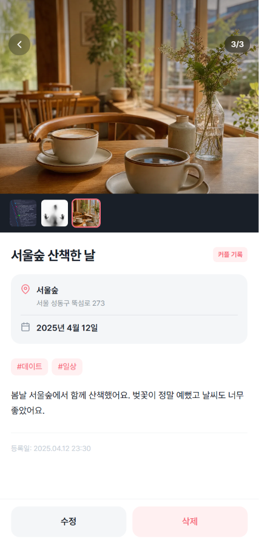</td>
    <td>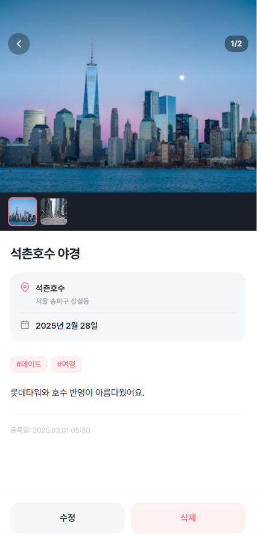</td>
  </tr>
</table>

#### 6. 새 기록 추가

* 제목, 사진, 방문 날짜, 장소, 태그, 기록 유형, 본문 정보를 작성하여 기록 추가 가능
* 작성 완료 시 타임라인, 지도 탭에 추가
* 기록 작성 및 수정 시 상대방 연인에게 알림 전송

<table>
  <tr>
    <td>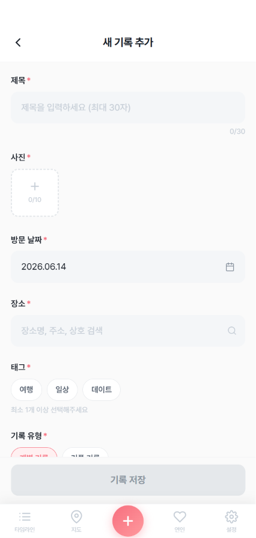</td>
    <td>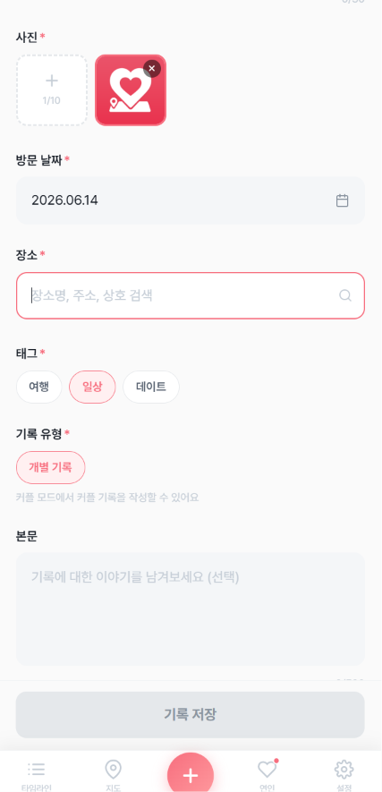</td>
  </tr>
</table>

#### 7. 설정

* 프로필, 이메일, 비밀번호 변경 가능
* 알림 설정
* 로그아웃 및 계정 삭제

<table>
  <tr>
    <td>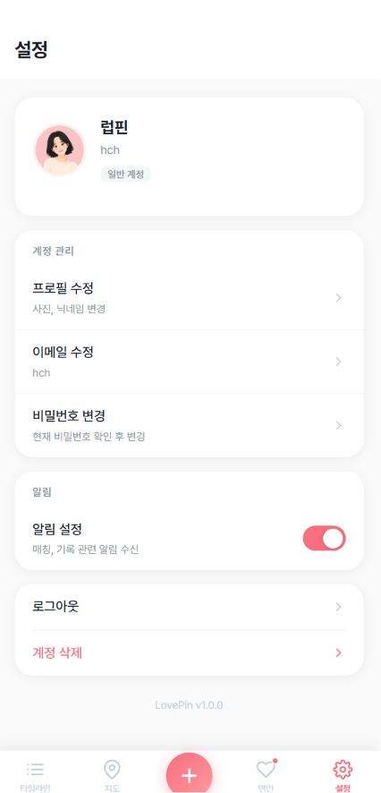</td>
    <td>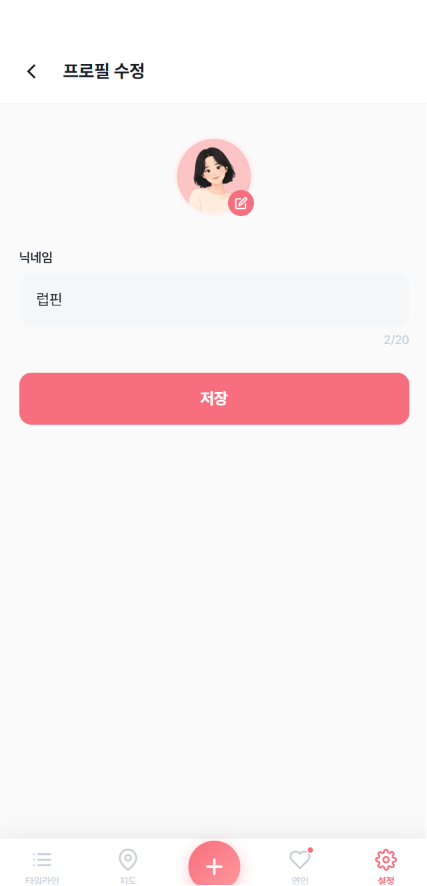</td>
  </tr>
</table>
