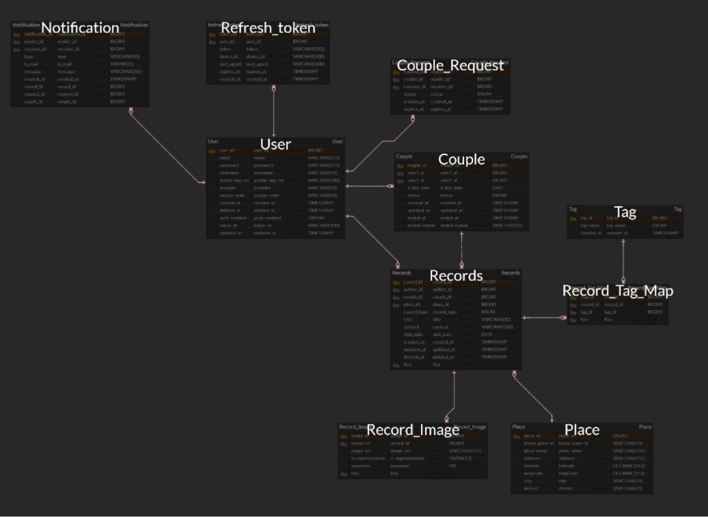

# **LovePin(럽핀)**

### 둘만의 장소와 추억을 지도에 남기는 커플 기록 서비스

기획개발 1팀 : 한채희, 박민수, 임하연, 진성현

---

## 1. 서비스 개요 및 목적

#### 기획 목적과 서비스 소개

LovePin(럽핀)은 커플이 함께 다녀온 장소를 지도 위에 기록하고, 사진과 글로 추억을 남길 수 있는 웹 기반 서비스입니다.

데이트나 여행이 많아질수록 사진, 장소, 날짜 등의 기록이 흩어져 관리하기 어려워집니다. LovePin은 이러한 추억을 지도 중심으로 정리하여, 커플이 함께한 순간을 더 쉽고 직관적으로 돌아볼 수 있도록 기획되었습니다.

또한 장소 기록, 사진 저장, 글 작성 등의 기능을 하나의 서비스 안에 담아 여러 앱을 따로 사용할 필요 없이 편리하게 추억을 관리하는 것을 목표로 합니다.

#### 타겟층

LovePin은 **데이트 및 여행을 자주 하는 20대 연인**을 주요 타겟으로 합니다.

함께 방문한 장소를 기록하고 싶은 커플, 사진과 글을 함께 정리하고 싶은 커플, 그리고 둘만의 추억 지도를 만들고 싶은 사용자에게 적합한 서비스입니다.

---

## 2. 기술 스택

### Frontend

* React, TypeScript, Vite
* React Router, Axios
* Tailwind CSS

### Backend

* Java 17, Spring Boot
* Spring Data JPA, Spring Security
* JWT, Gradle

### Database

* MySQL (AWS RDS)

### Infrastructure

* Backend: AWS Elastic Beanstalk
* Frontend: AWS S3, CloudFront
* CI/CD: GitHub Actions

---

## 3. API

### 외부 API

* **카카오맵 API** — 장소 검색 및 지도 표시 기능에 활용 예정
* **카카오 로그인 API** — 소셜 로그인 기능에 활용 예정

### 백엔드 API

LovePin은 프론트엔드와 백엔드 간 데이터 통신을 위해 REST API 구조를 기반으로 설계하였습니다.

배포 API 서버: `https://lovepin-api.hee.io.kr`

주요 API 도메인은 다음과 같습니다.

* **인증** — 로그인 및 토큰 기반 인증
* **회원** — 회원 정보 조회 및 관리
* **커플** — 커플 정보 조회 및 매칭 요청 관리
* **기록** — 데이트/여행 기록 조회 및 등록
* **장소** — 카카오 장소 기반 장소 정보 저장
* **이미지** — 기록 사진 업로드 및 관리
* **알림** — 알림 목록 및 미읽음 개수 조회
* **태그** — 기록 태그 조회

---

## 4. 주요 기능 소개

#### 1. 로그인

* 일반 / 카카오 간편 회원 가입 및 로그인

<table>
  <tr>
    <td></td>
    <td></td>
    <td></td>
  </tr>
</table>

#### 2. 연인 관계 관리

##### 2-1. 연인 매칭 전 개인 모드

* 상대방의 고유 코드를 입력하여 매칭 요청 가능 (본인 코드 입력 불가)
* 매칭 수신, 매칭 대기 등의 알림 확인 가능

<table>
  <tr>
    <td></td>
    <td></td>
  </tr>
</table>

##### 2-2. 연인 매칭 상태 커플 모드

* 자신과 상대방의 프로필 확인 가능
* D-Day 설정 및 수정 가능
* 연결 해제 가능
* 연인 관련 기록 알림, D-Day, 매칭 관련 알림 확인 가능

<table>
  <tr>
    <td></td>
    <td></td>
  </tr>
</table>

#### 3. 타임라인

* 연인과 본인이 작성한 기록을 상하 스크롤 타임라인 형식으로 확인 가능
* 태그, 위치, 작성 기간 필터링 가능
* 기록 클릭 시 상세 페이지로 이동

<table>
  <tr>
    <td></td>
    <td></td>
  </tr>
</table>

#### 4. 지도

* 위치마다 군집으로 묶어 대표 사진으로 위치 핀 표시
* 확대 정도에 따라 위치 핀을 세분화하여 표시 (시/군 → 구/동 → 상세 위치)
* 기록 유형 (커플 기록/개별 기록) 필터링 가능
* 위치 핀 클릭 시 해당 핀 군집의 기록 카드 확인 가능
* 기록 카드 하단 상세보기 클릭 시 상세 페이지로 이동

<table>
  <tr>
    <td></td>
    <td></td>
    <td></td>
  </tr>
  <tr>
    <td></td>
    <td></td>
  </tr>
</table>

#### 5. 상세 페이지

* 해당 기록의 제목, 본문, 위치, 작성 날짜, 태그, 사진 등 상세 정보를 확인
* 커플 기록의 경우 연인이 작성한 기록 수정 및 삭제 가능

<table>
  <tr>
    <td></td>
    <td></td>
  </tr>
</table>

#### 6. 새 기록 추가

* 제목, 사진, 방문 날짜, 장소, 태그, 기록 유형, 본문 정보를 작성하여 기록 추가 가능
* 작성 완료 시 타임라인, 지도 탭에 추가
* 기록 작성 및 수정 시 상대방 연인에게 알림 전송

<table>
  <tr>
    <td></td>
    <td></td>
  </tr>
</table>

#### 7. 설정

* 프로필, 이메일, 비밀번호 변경 가능
* 알림 설정
* 로그아웃 및 계정 삭제

<table>
  <tr>
    <td></td>
    <td></td>
  </tr>
</table>

---

## 5. 역할 분담 및 협업

### 역할 분담

| 구분       | 담당 인원    | 담당 내용                                              |
| -------- | -------- | -------------------------------------------------- |
| Frontend | 한채희, 진성현 | 화면 설계, 페이지 구성, 지도 기반 UI, API 연동 구조 구현              |
| Backend  | 박민수, 임하연 | 서버 구조 설계, REST API 설계, 데이터베이스 연동, 인증 및 기록 관련 기능 구현 |
| 공통       | 전체       | 서비스 기획, 기능 명세서 작성, DB스키마 설계, API 명세서 정리            |

### 사용 협업 툴

* **GitHub, Notion, Figma**
* **ERDCloud**: 데이터베이스 구조 설계 및 ERD 작성

### 개발 보조 도구

* **Manus**: 초기 프로토타입 및 코드 구조 생성 보조
* **Figma Make**: UI 디자인 및 프론트엔드 코드 생성 보조
* **Cursor, Gemini**: 코드 수정, 실행 및 디버깅 보조
